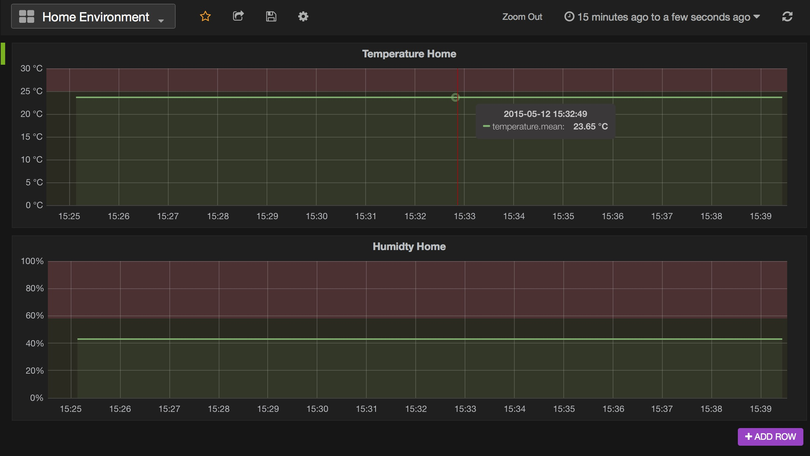

[](https://dashboard.tutum.co/stack/deploy/)

# A Nest thermostat dashboard, running on docker, built with PHP, InfluxDB and Grafana.



## Getting started

* Install docker
* Install docker-compose

## Build the stack

```
docker-compose up
```

## Todo
* Guide on how to get this running in no-time on Tutum Cloud
* Better scheduler
* Track current outside temperature/humidity
* Insert default dashboard/graphs for Nest data
